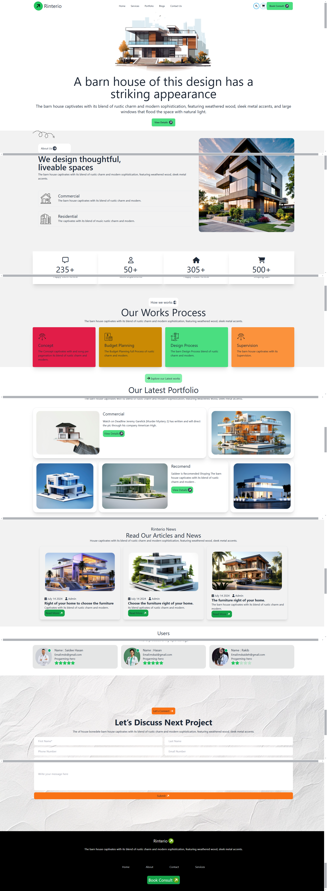

# Rinterio
##### It seems you are looking for a coding example or a project structure for a mobile application named "Rinterio" that is suitable for a device like a Redmi phone. Below, I’ll provide a simple structure for an HTML/CSS project that could represent a mobile application interface. This example will include sections for login, registration, and transactions, all styled with Tailwind CSS to ensure responsiveness on mobile devices.

- [Live Link](https://saidee-hasan.github.io/Rinterio/) 

